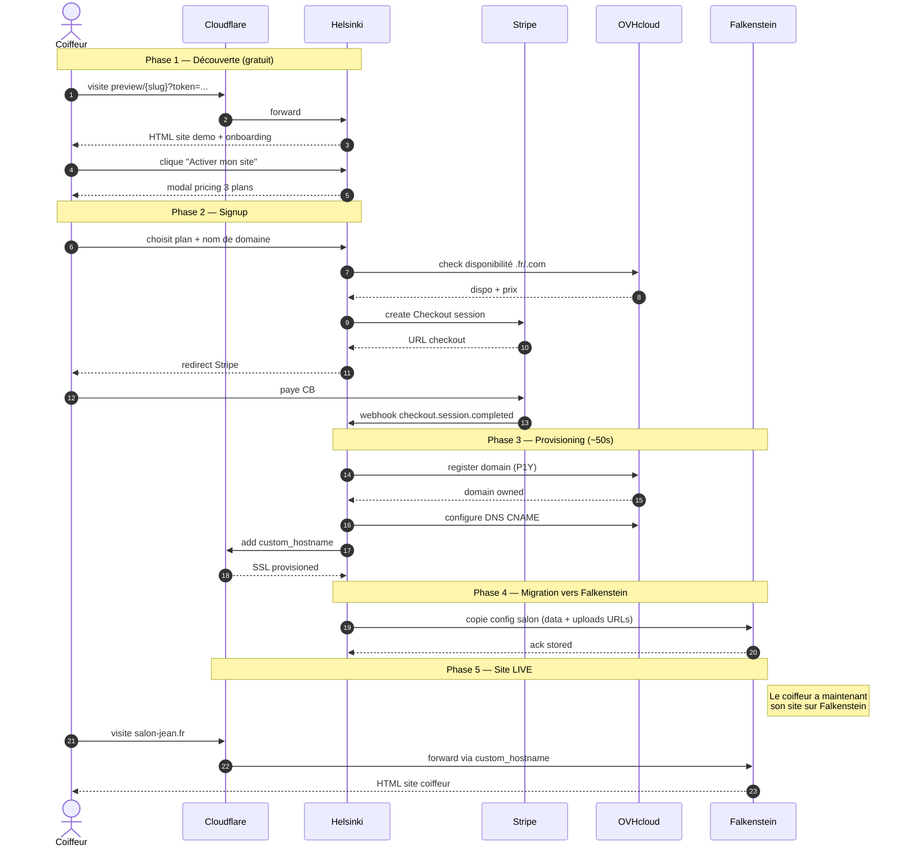
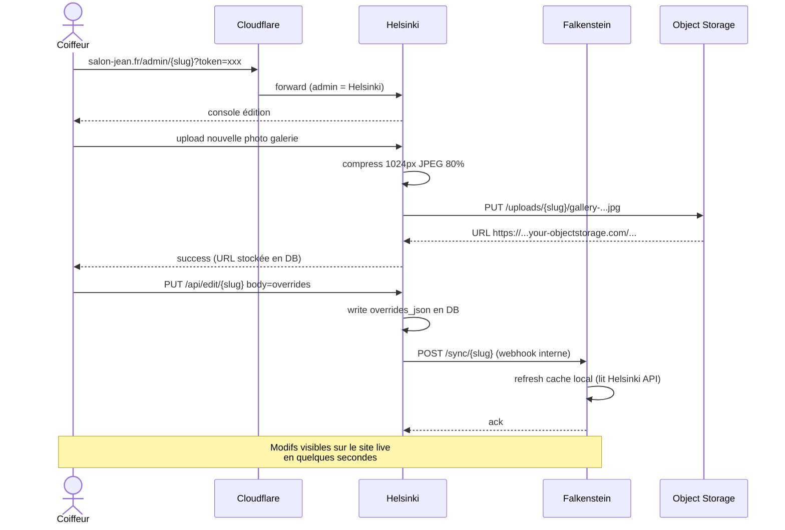
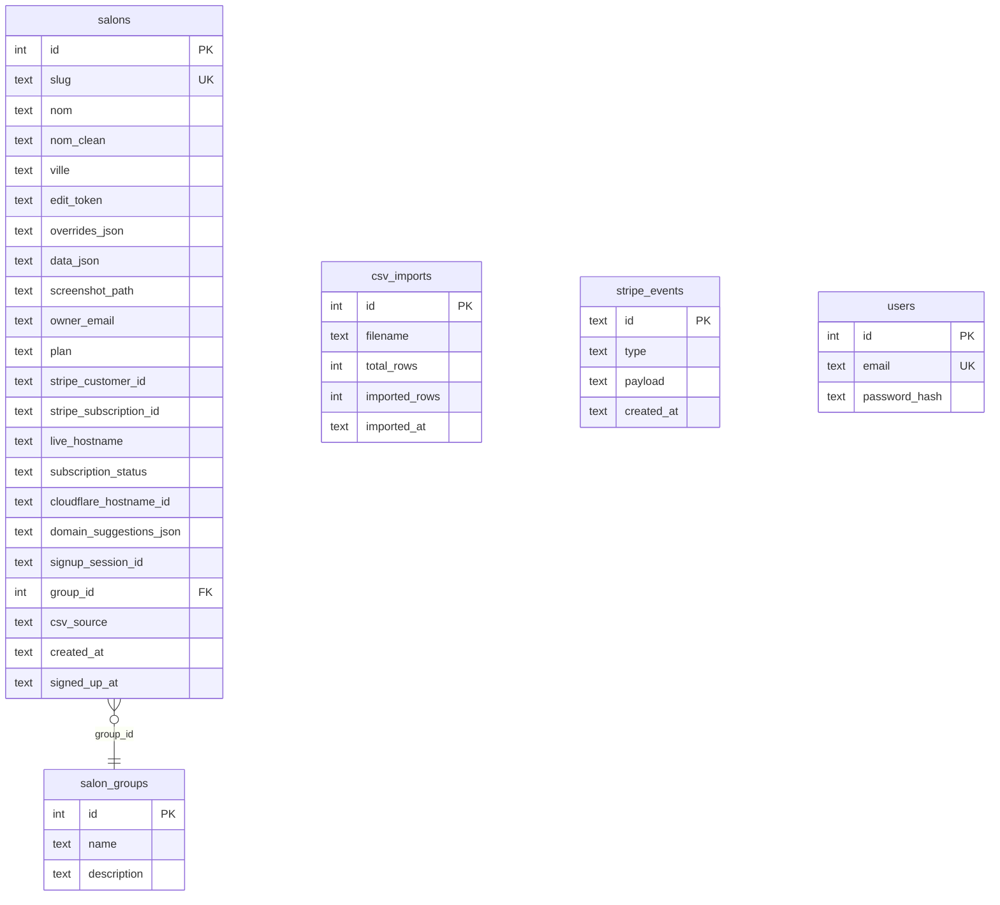
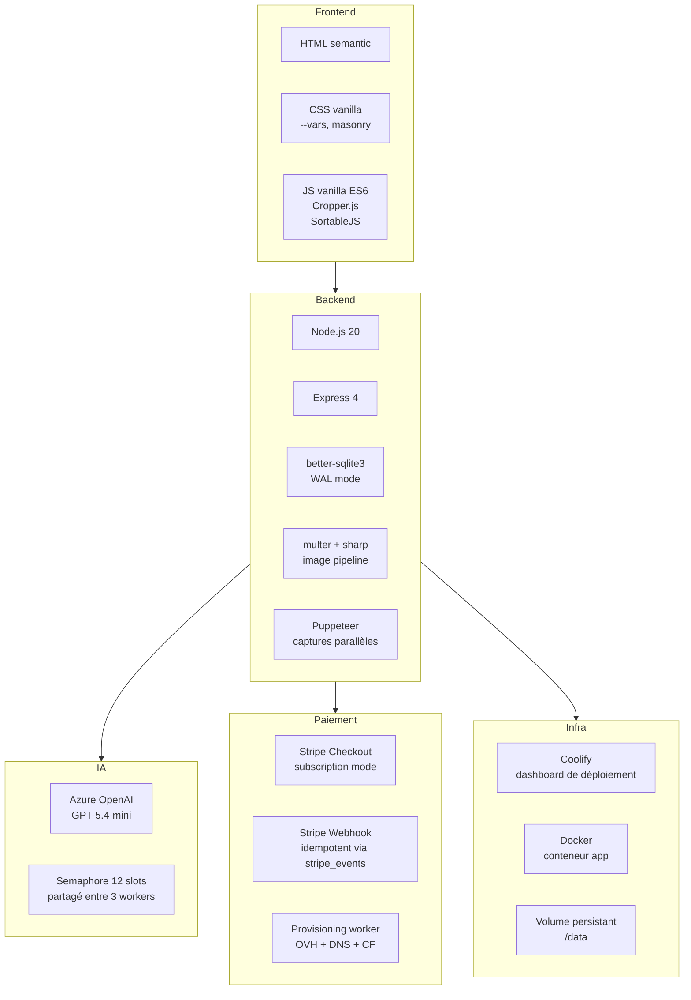

# Architecture monquicksite

> Documentation technique complète : serveurs, flows, données. Mise à jour : 2026-05-03.

GitHub rend automatiquement les diagrammes Mermaid ci-dessous.

---

## 🌍 Vue d'ensemble

Architecture distribuée : **chaque rôle a son serveur dédié**, isolés pour la fiabilité.

```mermaid
flowchart TB
    subgraph Internet
        V1[Visiteur d'un site coiffeur]
        V2[Coiffeur sur sa console admin]
        V3[Johann sur l'admin agence]
    end

    subgraph CF[" Cloudflare DNS + CDN + WAF + for SaaS "]
        CFCache[Cache CDN<br/>CSS/JS/IMG]
        CFSaaS[Custom hostnames<br/>salon-jean.fr → ...]
    end

    subgraph Helsinki["🏢 VPS Helsinki app.3high.fr — TOOLS"]
        H1["outil-coiffure (Node.js)"]
        H2["• Admin agence /admin"]
        H3["• Génération demos /preview/{slug}"]
        H4["• Admin coiffeur /admin/{slug}?token"]
        H5["• Captures Puppeteer 6 paral."]
        H6["• IA Azure (noms, présentations, domaines)"]
        H7["• Stripe webhook + provisioning"]
        H8[(SQLite salons.db)]
    end

    subgraph Falkenstein["🚀 VPS Falkenstein 138.201.152.222 — SITES CLIENTS LIVE"]
        F1["app multi-tenant Node.js"]
        F2["• Render uniquement /preview/{slug}"]
        F3["• Lit data via API Helsinki + cache 5min"]
        F4[(SQLite cache)]
    end

    subgraph Storage[" 📦 Stockage assets"]
        S1[Hetzner Object Storage<br/>uploads coiffeurs]
        S2[Volume Helsinki<br/>screenshots demos]
    end

    subgraph External["🔌 Services externes"]
        E1[Stripe<br/>paiements]
        E2[OVHcloud<br/>achat domaines]
        E3[Azure OpenAI<br/>GPT-5.4-mini]
        E4[Resend<br/>emails (V2)]
    end

    V1 --> CF
    V2 --> CF
    V3 --> CF

    CF -->|"outil.monsitehq.com"| Helsinki
    CF -->|"monsitehq.com /preview /admin"| Helsinki
    CFSaaS -.->|"fallback origin"| Falkenstein
    Falkenstein -->|"API readonly /api/salon/:slug"| Helsinki
    Helsinki --> External
    Helsinki --> S1
    Helsinki --> S2
    Falkenstein --> S1
```

---

## 🎯 Cartographie des serveurs

### VPS Helsinki — 65.21.146.193 — `app.3high.fr`
**Rôle** : Tools + admin + génération de demos + captures + IA. Le moteur de prospection.

| Composant | Détail |
|---|---|
| Hébergeur | Hetzner partagé (≠ dédié) |
| OS / Stack | Coolify dashboard |
| Disponibilité | Best effort (~99%) — peut redémarrer pendant un déploiement |
| Disque | 75 GB (partagé avec d'autres apps Johann, ~5 GB libres) |
| Apps en cours | outil-coiffure, Facture Tools, autres apps Johann |
| Apps déployées par signup ? | **Non** — uniquement la prospection |

### VPS Falkenstein — 138.201.152.222 — `customers.monsitehq.com`
**Rôle** : Servir les sites des coiffeurs payants (post-achat). Doit être très stable.

| Composant | Détail |
|---|---|
| Hébergeur | Hetzner cx33 dédié (4 vCPU, 8 GB RAM, 80 GB SSD, 20 TB) |
| OS / Stack | Coolify dashboard, isolation totale |
| Disponibilité | Cible 99,9% — aucune autre app dessus |
| Coût | 7,79€ TTC/mois |
| Apps | uniquement le render multi-tenant (V1 pending) |

### Cloudflare zone `monsitehq.com`
**Rôle** : DNS, CDN, WAF, DDoS, Cloudflare for SaaS pour les domaines custom.

| Élément | Valeur |
|---|---|
| Zone ID | `ef3d8d295069f3c38214ce55131bb8dc` |
| For SaaS activé | Oui (custom hostnames) |
| Fallback origin | `customers.monsitehq.com` (= Falkenstein) |
| Cache CDN | Activé sur /_assets, /uploads, /screenshots |

### Hetzner Object Storage (à activer)
**Rôle** : Stocker les uploads coiffeurs (hero, galerie). S3-compatible.

| Élément | Valeur |
|---|---|
| Région | Falkenstein (proche du VPS clients) |
| Forfait inclus | 1 TB stockage + 1 TB bandwidth |
| Coût mensuel | 1,20€ TTC pour < 5000 salons |
| Endpoint | `{bucket}.fsn1.your-objectstorage.com` |
| CDN | Cloudflare devant pour cache visiteurs |

---

## 💸 Flow d'achat d'un coiffeur

De la demo à un site live en ~5 minutes.



---

## ✏️ Flow de modification (coiffeur connecté)

Comment les modifs faites par le coiffeur arrivent sur son site live.



---

## 🗄 Schéma de données (DB SQLite)



**Notes** :
- `overrides_json` : modifs du coiffeur (textes, services, photos custom)
- `data_json` : données brutes du CSV scrap.io
- `subscription_status` : `pending` / `provisioning` / `live` / `cancelled` / `past_due` / `error`
- `domain_suggestions_json` : 10 noms pré-générés par GPT (sans TLD)

---

## 🧱 Stack technique par couche



---

## 📈 Plan de scaling

| Salons payants | Stockage | Bandwidth | Action |
|---|---|---|---|
| 0–100 | 200 MB | 5 GB/mois | RAS |
| 100–1 000 | 2 GB | 50 GB/mois | RAS, surveiller |
| 1 000–5 000 | 10 GB | 500 GB/mois | Activer monitoring CF |
| 5 000–10 000 | 50 GB | 2 TB/mois | Cluster Falkenstein (cx41) |
| 10 000+ | 100+ GB | 5+ TB/mois | Migration Postgres + Redis |

---

## 🔗 Liens externes

| Service | Console |
|---|---|
| Coolify Helsinki | http://app.3high.fr:8000 |
| Coolify Falkenstein | http://138.201.152.222:8000 |
| Cloudflare | https://dash.cloudflare.com |
| Stripe (test) | https://dashboard.stripe.com/test |
| OVH | https://www.ovh.com/manager |
| Hetzner Cloud | https://console.hetzner.cloud |
| GitHub repo | https://github.com/BillyBob36/outil-coiffure |
